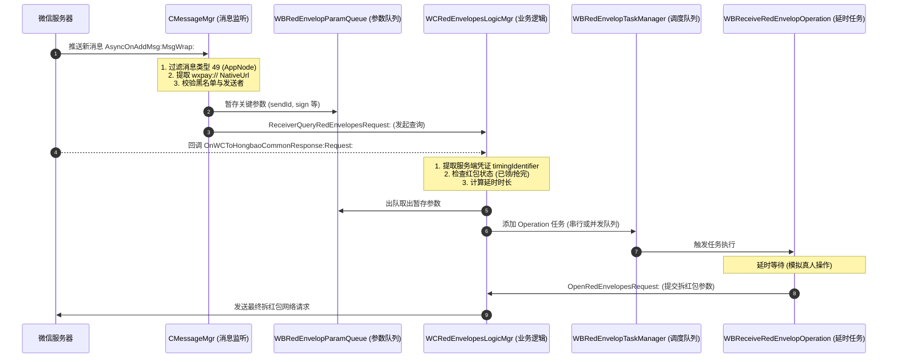

# iOS 版微信抢红包插件 (WeChatRedEnvelop)

[](https://apple.com)
[](https://weixin.qq.com)
[](#编译与构建)
[](LICENSE)

基于 iOS Objective-C / Logos 的微信全功能抢红包及辅助工具插件。原生无缝集成于微信设置中，支持延时抢红包、防并发排队、群聊过滤、抢自己红包及消息防撤回等功能。

本项目已全面针对**现代化 iOS 越狱生态（Rootless / Dopamine / Palera1n）**、**巨魔商店（TrollStore）**以及**免越狱打包侧载**进行了二次开发适配与架构梳理。

---

## 目录

- [功能特色](#功能特色)
- [核心架构与流程时序](#核心架构与流程时序)
- [二次开发指南](#二次开发指南)
- [编译与构建](#编译与构建)
- [安装使用方法](#安装使用方法)
- [安全防封建议](#安全防封建议)
- [截图展示](#截图展示)
- [版权与免责声明](#版权与免责声明)

---

## 功能特色

- **原生无缝交互**  
  无独立 App，直接嵌入微信“设置 -> 微信小助手”面板，体验平滑自然。
- **自定义/智能延迟抢红包**  
  支持自定义延时时长（秒），二次开发支持毫秒级随机波动抖动（Jitter），有效规避服务端秒抢外挂判定。
- **多红包防并发排队（串行队列）**  
  当多个群同时下起红包雨时，自动采用串行队列逐一拆解，最大程度降低瞬时高频并发带来的风控封号风险。
- **群聊过滤（黑白名单）**  
  直接复用微信原生的联系人选择器，可自由屏蔽工作群、点餐群、亲友群等特定会话。
- **支持抢自己发的红包**  
  支持自定义开关，满足测试与特定场景需要。
- **消息防撤回**  
  静默拦截好友撤回的消息，并在当前会话中生成原生风格的灰色系统拦截提醒。
- **语音消息一键转发（新增）**  
  长按聊天窗口中的任意语音气泡，菜单中直接提供【转发语音】选项，可直接批量多选好友或群聊转发，原汁原味还原真实语音（包含波形、时长秒数与原声播放）。在小助手高级设置中提供独立控制开关。
- **转发微信收藏语音（新增）**  
  支持将【微信收藏】中的语音直接原样转发给好友或群聊！在收藏语音详情页点击右上角菜单即可选择【作为语音转发给朋友】；在聊天窗口点击【+】->【收藏】选择语音时，亦可直接以原生语音条形式发出。
- **二次开发扩展功能（可定制）**  
  - 红包关键词过滤（跳过包含“测挂”、“专属”、“别抢”等字样的红包）。
  - 专属红包识别过滤（非本人专属红包自动跳过，防尴尬、防暴露）。
  - 自动感谢语回复（领完红包后自动在群内发送“谢谢老板”）。
  - 红包账本与金额流水统计。

---

## 核心架构与流程时序

微信红包领取需经过两步握手协议：**参数查询**（获取服务端校验凭证 `timingIdentifier`）与**拆开红包**（提交身份凭证）。



---

## 二次开发指南

本项目提供了详尽的 AI Agent 与逆向工程技术手册：[`agent.md`](./agent.md)。在开始二次开发前强烈建议通读。

### 目录结构

```
├── Makefile                            # Theos 构建配置文件
├── control                             # Debian 包元信息定义
├── WeChatRedEnvelop.plist              # Tweak 注入规则 (Filter: com.tencent.xin)
├── agent.md                            # 核心架构手册与二次开发规范
├── README.md                           # 本项目文档
└── src/
    ├── Tweak.xm                        # Logos Hook 核心实现
    ├── WeChatRedEnvelop.h              # 微信私有头文件声明
    ├── WeChatRedEnvelopParam.h/.m      # 拆包参数模型
    ├── WBRedEnvelopParamQueue.h/.m     # 跨异步回调参数队列
    ├── WBReceiveRedEnvelopOperation.h/.m # NSOperation 延时拆包任务
    ├── WBRedEnvelopTaskManager.h/.m    # 并发/串行调度器
    ├── WBRedEnvelopConfig.h/.m         # 用户配置单例 (NSUserDefaults)
    ├── WBSettingViewController.h/.m    # 小助手设置页 UI
    ├── WBVoiceForwardManager.h/.m      # 语音消息一键转发管理器
    └── WBBaseViewController.h/.m       # 基础控制器 (Loading HUD 封装)
```

### 快速新增配置项与 UI 开关流程

1. **在 `WBRedEnvelopConfig.h/.m` 中添加属性并持久化**：
   ```objc
   // WBRedEnvelopConfig.h
   @property (assign, nonatomic) BOOL keywordFilterEnable;
   ```
2. **在 `WBSettingViewController.m` 中添加单元格**：
   ```objc
   [sectionInfo addCell:[objc_getClass("WCTableViewCellManager") switchCellForSel:@selector(settingKeywordFilter:) 
                                                                           target:self 
                                                                            title:@"关键词过滤" 
                                                                               on:[WBRedEnvelopConfig sharedConfig].keywordFilterEnable]];
   ```
3. **在 `src/Tweak.xm` 中加入过滤拦截逻辑**。

---

## 编译与构建

### 1. 前置依赖
- 安装 [Theos](https://theos.dev/) 构建环境：
  ```bash
  bash -c "$(curl -fsSL https://raw.githubusercontent.com/theos/theos/master/bin/install-theos)"
  ```
- 确保系统环境变量已导出 `$THEOS`。

### 2. 编译选项

- **现代无根越狱（Rootless，适用于 Dopamine、Palera1n、iOS 15+）**：
  ```bash
  THEOS_PACKAGE_SCHEME=rootless make clean package
  ```
- **传统有根越狱（Rootful，适用于 iOS 14 及以下越狱）**：
  ```bash
  THEOS_PACKAGE_SCHEME=rootful make clean package
  ```
- **通过 SSH 局域网一键打包并安装到测试机**：
  ```bash
  make package install THEOS_DEVICE_IP=192.168.x.x THEOS_DEVICE_PORT=22
  ```

---

## 安装使用方法

### 方式一：越狱设备安装（推荐）
1. 编译后在 `packages/` 目录下生成 `.deb` 文件。
2. 通过 AirDrop、微信文件传输或 scp 传输至手机，在 **Sileo / Zebra / Filza** 中打开并点击“安装”。
3. 软重启或注销（Respring）后，重新打开微信即可。

### 方式二：TrollStore 巨魔商店免越狱安装
1. 将编译生成的动态库（`.dylib`）及资源 `.bundle` 提取出来。
2. 使用 **TrollFools**（巨魔注入神器）直接在手机端将 Dylib 注入到已安装的官方微信中；
3. 或者使用 **Azule** / **insert_dylib** 将插件注入解包后的 WeChat.ipa，再通过 TrollStore 安装。

### 方式三：免越狱侧载（Sideloading）
1. 使用 [MonkeyDev](https://github.com/AloneMonkey/MonkeyDev) 或 Xcode 创建侧载工程。
2. 将 `src/` 下的代码及资源导入 MonkeyDev 模板。
3. 连接手机，配置个人免费开发者证书或企业证书，直接编译运行即可。

---

## 安全防封建议

> [!WARNING]
> 微信对自动化红包外挂有严格的服务端与客户端风控检测。请注意：

1. **切勿设置“0秒无延时”**：消息推送至拆包耗时小于 0.2 秒会极高概率被标记异常，建议设置 **1.0 ~ 3.0 秒**。
2. **务必保留 `timingIdentifier` 验证**：本插件源码已严格校验查询凭据，切勿在二次开发中为了追求速度强行绕过 `ReceiverQuery` 流程。
3. **开启“防止同时抢多个红包”**：在多群活跃场景下，串行队列能够保证行为特征平缓，避免瞬时并发拆包引发封控。
4. **低调使用**：避免在非常驻群中频繁秒抢红包，防止被群友人工举报封禁。

---

## 截图展示

| 设置入口 | 微信小助手设置页 |
| :---: | :---: |
|  |  |

---

## 版权与免责声明

- 本项目仅供 iOS 逆向工程与移动安全技术交流与学习，严禁用于商业用途或非法牟利。
- 使用本插件需使用者自行承担各类风险，包括但不限于“微信红包功能受限”、“微信临时/永久封号”等，原作者与二次开发维护者不承担任何法律责任。
- 原项目作者：[buginux](https://github.com/buginux/WeChatRedEnvelop)。
