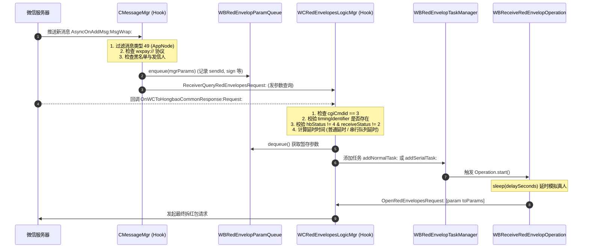

# WeChatRedEnvelop 二次开发 Agent 核心技术手册

本文档为参与 **WeChatRedEnvelop (iOS 版微信抢红包 Tweak)** 二次开发的 AI Agent 及逆向开发者提供底层的架构解析、Hook 机制图谱、反风控策略、高版本兼容性改造指南以及扩展功能实战蓝图。

---

## 1. 项目核心背景与技术栈

- **代码语言**：Objective-C, Logos (`.xm`)
- **构建系统**：Theos (`Makefile`, `control`, `WeChatRedEnvelop.plist`)
- **运行环境**：
  - 传统越狱设备（Rootful）：Cydia Substrate / Substrate 兼容层
  - 现代无根越狱设备（Rootless，iOS 15+）：ElleKit / Dopamine / Palera1n
  - 免越狱 / 巨魔（TrollStore）环境：通过 Dylib 动态库注入签名打包
- **注入目标**：微信客户端 (`com.tencent.xin`)

---

## 2. 核心架构与模块职责拓扑

```
src/
├── Tweak.xm                        # Logos Hook 核心实现（消息监听、响应拦截、设置注入）
├── WeChatRedEnvelop.h              # 微信内部类/方法头文件声明（从 class-dump 逆向提取）
├── WeChatRedEnvelopParam.h/.m      # 拆红包参数模型（msgType, sendId, timingIdentifier 等）
├── WBRedEnvelopParamQueue.h/.m     # 参数队列（跨异步回调传递抢红包参数）
├── WBReceiveRedEnvelopOperation.h/.m # NSOperation 异步任务封装（延时并发送 Open 请求）
├── WBRedEnvelopTaskManager.h/.m    # 任务调度器（串行队列与并发队列管理）
├── WBRedEnvelopConfig.h/.m         # 配置单例，通过 NSUserDefaults 持久化用户设置
├── WBSettingViewController.h/.m    # 微信内置小助手设置页面（基于微信内部 TableView 架构）
├── WBVoiceForwardManager.h/.m      # 语音消息一键转发管理器（气泡菜单与底层音频转发调度）
└── WBBaseViewController.h/.m       # 基础视图控制器（封装 MMLoadingView 交互）
```

---

## 3. Hook 机制与完整调用链深度剖析

### 3.1 抢红包完整时序与状态机

微信红包的领取需要经过 **两步网络握手协议**：
1. **参数查询（ReceiverQueryRedEnvelopesRequest）**：获取该红包的有效性、是否已领取过，以及服务端防外挂凭证 `timingIdentifier`。
2. **拆红包（OpenRedEnvelopesRequest）**：携带 `timingIdentifier` 与用户身份凭证发起实际领取请求。



### 3.2 关键 Hook 点与源码逻辑分解

#### A. 消息监听入口：`CMessageMgr -> AsyncOnAddMsg:MsgWrap:`
- **消息类型**：`wrap.m_uiMessageType == 49`（应用分享消息，包含微信红包、转账等）。
- **红包判定**：`[wrap.m_nsContent rangeOfString:@"wxpay://"].location != NSNotFound`。
- **Native URL 解析**：截取 `wxpay://c2cbizmessagehandler/hongbao/receivehongbao?` 后续 QueryString，提取 `msgtype`, `sendid`, `channelid`, `sign`。
- **发信人与黑白名单**：
  - 群聊发信人：`wrap.m_nsFromUsr` 带有 `@chatroom` 后缀。
  - 自己发红包：`[wrap.m_nsFromUsr isEqualToString:selfContact.m_nsUsrName]`。
  - 黑名单过滤：`[[WBRedEnvelopConfig sharedConfig].blackList containsObject:wrap.m_nsFromUsr]`。

#### B. 核心反外挂响应拦截：`WCRedEnvelopesLogicMgr -> OnWCToHongbaoCommonResponse:Request:`
- **接口识别**：`arg1.cgiCmdid == 3` 为红包查询响应。
- **风控核心字段**：
  - `responseDict[@"timingIdentifier"]`：**极其关键！** 微信服务端为了对抗内存秒抢外挂，在查询响应中下发一次性令牌 `timingIdentifier`。若最终 Open 请求缺失该字段，微信风控系统将立即标记客户端并封禁红包功能。
  - `responseDict[@"receiveStatus"] == 2`：当前用户已领取过，跳过。
  - `responseDict[@"hbStatus"] == 4`：红包已被抢完，跳过。

#### C. 任务延时与拆解：`WBReceiveRedEnvelopOperation -> main`
- 在 `NSOperation` 中调用 `sleep(self.delaySeconds)` 实现延时。
- 通过单例上下文获取 `WCRedEnvelopesLogicMgr`，调用 `OpenRedEnvelopesRequest:` 提交最终拆红包参数字典。

#### D. 微信原生设置注入：`NewSettingViewController -> reloadTableData`
- 利用 MSHookIvar 获取私有成员 `m_tableViewMgr` (`WCTableViewManager`)。
- 在第 0 个 Section 插入自定义 Cell `微信小助手`，点击推入 `WBSettingViewController`。

#### E. 消息防撤回：`CMessageMgr -> onRevokeMsg:`
- 拦截微信撤回消息协议包，解析 XML 内容（包含 `<session>`, `<replacemsg>`, 撤回者昵称）。
- 构造一条系统通知伪消息（`0x2710` 即 10000 类型的系统提示消息）。
- 调用 `[self AddLocalMsg:parseSession() MsgWrap:msgWrap fixTime:0x1 NewMsgArriveNotify:0x0]` 实现静默拦截并在会话中提示。

---

## 4. 关键反风控机制（Anti-Ban & Risk Control）

微信对自动化外挂有一整套客户端与服务端协同的风控对抗算法，二次开发时**必须严格遵守以下准则**：

| 风控检测维度 | 微信检测特征 | 本插件防御方案 / 二次开发建议 |
| :--- | :--- | :--- |
| **凭证校验** | 检测拆包请求是否缺少 `timingIdentifier` | 必须完成 `ReceiverQuery` 流程，拿到合法的 `timingIdentifier` 后再发起 `Open`，严禁伪造或跳过查询。 |
| **行为速度** | 消息到达与拆开的时间差 $\Delta t < 0.1s$ | 严禁使用固定 0 秒延时！建议二次开发引入**高斯分布/随机抖动延时**（如 $1.2s \sim 3.0s$ 动态随机浮动）。 |
| **并发频率** | 多个群红包同时爆发，多线程同毫秒拆包 | 开启 `serialReceive`（串行队列），前一个红包拆完并间隔 1~3 秒后再拆下一个。 |
| **界面层级验证** | 部分微信版本会校验当前 View 栈顶是否处于聊天界面 | 若微信开启了严格的前台 UI 栈校验，需 Hook 模拟视图控制器的展示事件。 |
| **后台心跳与休眠** | 微信在后台/锁屏时被杀或被风控判定为常驻后台 | 尽量在微信处于前台活跃状态时工作；若需后台抢红包，应谨慎处理后台任务生命周期。 |

---

## 5. 微信版本演进适配与历史技术债

在针对高版本微信（如 8.0.30 ~ 8.0.50+）二次开发时，需特别注意以下兼容性差异：

### 5.1 服务管理器获取方式的变更
- **旧版微信 (6.x - 7.x)**：
  ```objc
  MMServiceCenter *center = [%c(MMServiceCenter) defaultCenter];
  CMessageMgr *msgMgr = [center getService:%c(CMessageMgr)];
  ```
- **8.0.x 经典架构**：
  ```objc
  MMContext *context = [%c(MMContext) activeUserContext];
  CMessageMgr *msgMgr = [context getService:%c(CMessageMgr)];
  ```
- **高版本防御式适配写法（推荐在二次开发中统一使用）**：
  ```objc
  static id GetWeChatService(Class serviceClass) {
      if (objc_getClass("MMContext")) {
          MMContext *context = [objc_getClass("MMContext") activeUserContext];
          if (context && [context respondsToSelector:@selector(getService:)]) {
              return [context getService:serviceClass];
          }
      }
      if (objc_getClass("MMServiceCenter")) {
          id center = [objc_getClass("MMServiceCenter") performSelector:@selector(defaultCenter)];
          if (center && [center respondsToSelector:@selector(getService:)]) {
              return [center performSelector:@selector(getService:) withObject:serviceClass];
          }
      }
      return nil;
  }
  ```

### 5.2 `UIAlertView` 已被 iOS 废弃
原版代码在 `WBSettingViewController.m` 中使用了 `UIAlertView`（iOS 9 已废弃，iOS 14+ 可能崩溃或无法弹出），二次开发必须迁移为 `UIAlertController`：
```objc
UIAlertController *alert = [UIAlertController alertControllerWithTitle:@"延迟抢红包(秒)" 
                                                               message:nil 
                                                        preferredStyle:UIAlertControllerStyleAlert];
[alert addTextFieldWithConfigurationHandler:^(UITextField * _Nonnull textField) {
    textField.placeholder = @"延迟时长(秒)";
    textField.keyboardType = UIKeyboardTypeDecimalPad;
    textField.text = [NSString stringWithFormat:@"%ld", (long)[WBRedEnvelopConfig sharedConfig].delaySeconds];
}];
[alert addAction:[UIAlertAction actionWithTitle:@"取消" style:UIAlertActionStyleCancel handler:nil]];
[alert addAction:[UIAlertAction actionWithTitle:@"确定" style:UIAlertActionStyleDefault handler:^(UIAlertAction * _Nonnull action) {
    NSString *text = alert.textFields.firstObject.text;
    [WBRedEnvelopConfig sharedConfig].delaySeconds = [text integerValue];
    [self reloadTableData];
}]];
[self presentViewController:alert animated:YES completion:nil];
```

### 5.3 资源路径在 Rootless 与免越狱下的适配
原版中：
```objc
#define kBundlePath @"/Library/MobileSubstrate/DynamicLibraries/com.swiftyper.wechatredenvelop.bundle"
```
**严重隐患**：在无根越狱（Rootless 下路径为 `/var/jb/Library/...`）或 TrollStore/MonkeyDev 免越狱打包下，绝对路径会导致资源图片读取失败而闪退！
**修复策略**：
```objc
+ (NSBundle *)pluginBundle {
    static NSBundle *bundle = nil;
    static dispatch_once_t onceToken;
    dispatch_once(&onceToken, ^{
        NSString *bundlePath = [[NSBundle mainBundle] pathForResource:@"com.swiftyper.wechatredenvelop" ofType:@"bundle"];
        if (!bundlePath) {
            // Rootless 路径适配
            bundlePath = @"/var/jb/Library/MobileSubstrate/DynamicLibraries/com.swiftyper.wechatredenvelop.bundle";
        }
        if (![[NSFileManager defaultManager] fileExistsAtPath:bundlePath]) {
            // 传统 Rootful 路径
            bundlePath = @"/Library/MobileSubstrate/DynamicLibraries/com.swiftyper.wechatredenvelop.bundle";
        }
        bundle = [NSBundle bundleWithPath:bundlePath];
    });
    return bundle;
}
```

### 5.4 参数队列（`WBRedEnvelopParamQueue`）的线程安全隐患
原版使用 `NSMutableArray` 且无锁保护。如果极短时间内多个群同时发红包，`enqueue:` 与 `dequeue` 在不同线程同时执行会导致数组野指针崩溃（`EXC_BAD_ACCESS`）。
**优化策略**：
在 `WBRedEnvelopParamQueue.m` 中加入互斥锁或 `@synchronized(self.queue)` 进行读写保护。

---

## 6. 二次开发功能扩展蓝图与实战模板

### 6.1 扩展功能 1：随机浮动延时（防封神器）

#### 需求描述
固定延时（如总是 2 秒）极易被大数据风控模型识别。增加基准延时 + 随机抖动（如 1.0s ~ 3.0s 浮动）。

#### 实现步骤
1. **修改 `WBRedEnvelopConfig`**：
   ```objc
   // WBRedEnvelopConfig.h
   @property (assign, nonatomic) BOOL randomDelayEnable;
   @property (assign, nonatomic) float minDelay;
   @property (assign, nonatomic) float maxDelay;
   ```
2. **在计算延时处动态生成浮点随机数**：
   ```objc
   - (float)calculateDelayTime {
       if (![WBRedEnvelopConfig sharedConfig].randomDelayEnable) {
           return (float)[WBRedEnvelopConfig sharedConfig].delaySeconds;
       }
       float min = [WBRedEnvelopConfig sharedConfig].minDelay;
       float max = [WBRedEnvelopConfig sharedConfig].maxDelay;
       if (max <= min) return min;
       float random = ((float)arc4random() / ARC4RANDOM_MAX); // 0.0 ~ 1.0
       return min + random * (max - min);
   }
   ```
3. **改造 `WBReceiveRedEnvelopOperation`**：
   将 `sleep(self.delaySeconds)` 改为高精度的 `usleep((useconds_t)(self.delaySeconds * 1000000))` 或 `[NSThread sleepForTimeInterval:self.delayTime]`。

---

### 6.2 扩展功能 2：红包关键词过滤（避雷防踢）

#### 需求描述
很多群聊会发“测挂”、“专包”、“别抢”等带有特定祝福语或测试备注的红包，若抢了会被踢出群。

#### 实现步骤
1. **在 `CMessageWrap` 中解析红包描述**：
   红包的祝福语通常存储在 `m_nsDesc` 或 XML 节点的 `<wishing><![CDATA[恭喜发财]]></wishing>`。
   ```objc
   NSString *wishing = [self extractWishingFromMessageWrap:wrap];
   ```
2. **在 `CMessageMgr AsyncOnAddMsg:MsgWrap:` 的 `shouldReceiveRedEnvelop` 中增加判定**：
   ```objc
   BOOL (^containsBlockedKeyword)(NSString *content) = ^BOOL(NSString *content) {
       NSArray *blockedKeywords = [WBRedEnvelopConfig sharedConfig].blockedKeywords;
       for (NSString *keyword in blockedKeywords) {
           if ([content rangeOfString:keyword options:NSCaseInsensitiveSearch].location != NSNotFound) {
               return YES; // 命中黑名单关键词
           }
       }
       return NO;
   };

   if (containsBlockedKeyword(wishing)) {
       NSLog(@"[WeChatRedEnvelop] 命中黑名单关键词: %@，放弃领取", wishing);
       return NO;
   }
   ```

---

### 6.3 扩展功能 3：专属红包判断（防抢他人专属）

#### 需求描述
微信新增了“专属红包”功能，如果发给特定群成员，其他成员点击会提示“这是给别人的专属红包”。自动抢外挂如果盲目去抢会直接暴露。

#### 实现步骤
1. 在 `wrap.m_nsContent` 中匹配专属红包标志位（XML 包含 `<exclusive_recv_username>` 或 `exclusive_recv_list`）。
2. 判断 `exclusive_recv_username` 是否包含自己当前的 `m_nsUsrName`。若不包含且非空，则直接跳过拆包。

---

### 6.4 扩展功能 4：抢到红包自动回复感谢语

#### 需求描述
抢完红包后，自动在当前群聊中发送“谢谢老板！”或随机文案，更具真人感。

#### 实现步骤
1. **监听拆包成功回调**：
   在 `WCRedEnvelopesLogicMgr OnWCToHongbaoCommonResponse:Request:` 中，当 `cgiCmdid == 4`（拆红包请求回应）且 `errorType == 0` 时即为领取成功。
2. **调用微信发消息接口**：
   ```objc
   void SendTextMessage(NSString *toUser, NSString *content) {
       CMessageMgr *msgMgr = GetWeChatService(objc_getClass("CMessageMgr"));
       CMessageWrap *textWrap = [[objc_getClass("CMessageWrap") alloc] initWithMsgType:1];
       [textWrap setM_nsFromUsr:[[GetWeChatService(objc_getClass("CContactMgr")) getSelfContact] m_nsUsrName]];
       [textWrap setM_nsToUsr:toUser];
       [textWrap setM_nsContent:content];
       [textWrap setM_uiCreateTime:(NSUInteger)[[NSDate date] timeIntervalSince1970]];
       [textWrap setM_uiStatus:1];
       
       if ([msgMgr respondsToSelector:@selector(AddMsg:MsgWrap:)]) {
           [msgMgr AddMsg:toUser MsgWrap:textWrap];
       }
   }
   ```

---

### 6.5 扩展功能 5：红包流水统计与小账本

#### 需求描述
记录每次抢红包的金额、发包发件人、群名称、领取时间，并在设置页中提供数据汇总视图。

#### 实现方案
- 在 `cgiCmdid == 4` 拆包成功回调中，解析 `retText` JSON 字典中的 `real_amount` 或 `amount`。
- 本地使用 `NSKeyedArchiver` 或 SQLite/CoreData 存储记录，避免占用过多内存。

---

## 7. 构建与编译环境配置

### 7.1 Makefile 现代无根/有根双构架支持
```makefile
# 支持无根越狱环境变量 (Dopamine 等可在编译时传 THEOS_PACKAGE_SCHEME=rootless)
THEOS_PACKAGE_SCHEME ?= rootless

TARGET = iphone:clang:latest:14.0
ARCHS = arm64 arm64e

BUNDLE_NAME = com.swiftyper.wechatredenvelop
ifeq ($(THEOS_PACKAGE_SCHEME),rootless)
  com.swiftyper.wechatredenvelop_INSTALL_PATH = /Library/MobileSubstrate/DynamicLibraries
else
  com.swiftyper.wechatredenvelop_INSTALL_PATH = /Library/MobileSubstrate/DynamicLibraries
endif

include $(THEOS)/makefiles/common.mk
include $(THEOS)/makefiles/bundle.mk

TWEAK_NAME = WeChatRedEnvelop
WeChatRedEnvelop_FILES = $(wildcard src/*.m) src/Tweak.xm
WeChatRedEnvelop_FRAMEWORKS = UIKit Foundation CoreGraphics
WeChatRedEnvelop_CFLAGS = -fobjc-arc -Wno-deprecated-declarations

include $(THEOS_MAKE_PATH)/tweak.mk

after-install::
	install.exec "killall -9 WeChat"
```

### 7.2 常用编译命令
- **标准无根越狱包构建**：
  ```bash
  THEOS_PACKAGE_SCHEME=rootless make clean package
  ```
- **传统有根越狱包构建**：
  ```bash
  THEOS_PACKAGE_SCHEME=rootful make clean package
  ```
- **通过 SSH 部署到测试机**：
  ```bash
  make package install THEOS_DEVICE_IP=192.168.1.100 THEOS_DEVICE_PORT=22
  ```

---

## 8. AI Agent 开发规范与代码守则

在为本项目编写或修改代码时，Agent 必须遵守以下原则：

1. **绝对避免直接崩溃（Fail-Safe）**：
   - 微信内部类名和方法签名随版本变化频繁。严禁在未做类型检查的情况下盲目强制转换或调用未经验证的 selector。
   - 必须使用 `respondsToSelector:`、`objc_getClass` 进行防御性校验。
2. **Logos 语法规范**：
   - 任何新增的 Hook 方法若不存在于原类中，必须声明 `%new`。
   - 调用原方法逻辑务必保留 `%orig`，不要吞掉系统核心消息处理链路。
3. **ARC 内存安全与强引用循环**：
   - 异步 Block（如 `parseRequestSign`）中若引用外部变量，必须审视是否存在循环引用。
   - 涉及 `NSOperation` 与队列任务时，注意释放持有对象。
4. **代码整洁与注释**：
   - 在关键风控字段及协议解析处添加清晰中文注释，方便维护及审查。
